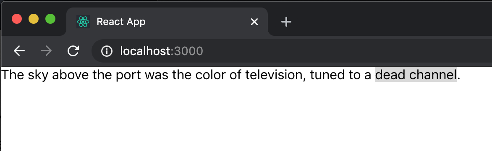
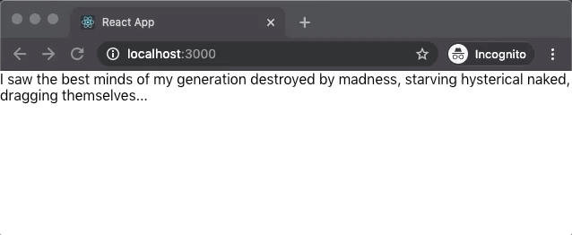

# react-interactive-highlighter

A React component to select and display an arbitrary number of highlighted subsections in a text body.

A lot of other highlighter components focus on display only, and expect logic outside of the component to determine which strings should be highlighted. While `react-interactive-highlighter` can be used this way, it _also_ allows creation of new highlights at runtime via text selection.

## Installation

This is a standard `npm` package, installable with:

> `npm i react-interactive-highligher`

or:

> `yarn add react-interactive-highlighter`

## Usage

For the most basic usage, simply provide the text block to be highlighted, and a list of highlights, which are defined by their start position in the text block and their length. (If the highlight list is empty, nothing will be highlighted.)

```css
.highlighted {
    background-color: #d9d9d9
}
```

```ts
import React from 'react';
import ReactDOM from 'react-dom';
import { InteractiveHighlighter } from 'react-interactive-highlighter';
import './index.css';

class TextWithHighlights extends React.Component {
    render() {
        const text = "The sky above the port was the color of television, tuned to a dead channel."
        const highlights = [
            { startIndex: 63, numChars: 12 }
        ]
        return (
            <InteractiveHighlighter
                text={text}
                highlights={highlights}
                customClass='highlighted'
            />
        )
    }
}

ReactDOM.render(<TextWithHighlights />, document.getElementById('root'));
```



If a `selectionHandler()` is provided, it will be called `onMouseUp` to allow new highlights to be created:

```ts
import * as React from 'react';
import ReactDOM from 'react-dom';
import { InteractiveHighlighter } from 'react-interactive-highlighter';
import './index.css';

class TextWithHighlights extends React.Component {
    constructor() {
        super();
        this.state = {
            text: "I saw the best minds of my generation destroyed by madness, starving hysterical naked, dragging themselves...",
            highlights: []
        }
        this.selectionHandler = this.selectionHandler.bind(this);
    }

    selectionHandler(selected, startIndex, numChars) {
        this.setState({
            text: this.state.text,
            highights: this.state.highlights.push({
                startIndex: startIndex,
                numChars: numChars
            })
        })
    }

    render() {
        return (
            <InteractiveHighlighter
                text={this.state.text}
                highlights={this.state.highlights}
                customClass='highlighted'
                selectionHandler={this.selectionHandler}
            />
        )
    }
}

ReactDOM.render(<TextWithHighlights />, document.getElementById('root'));
```



<!-- http://www.giphy.com/gifs/iJ1fTaqEc5TbETRgcC -->

### Features

* Supports multiple highlights
* Overlapping highlights are supported
* Implementation is all strongly typed

## Props

| Property | Type | Required? | Description |
|:---|:---|:---:|:---|
| text | String | Yes | The text containing highlights. |
| customClass | String |  | CSS class used for highlighted sections ("default" if not defined). |
| highlights | List of objects | Yes | List of highlights, each defined by an object with properties `startIndex` (from 0) and `numChars` |
| selectionHandler | Function |  | Called whenever a new selection is made (via `onMouseUp`) - will receive the selected string, its start index in the `text` param, and its length. |
| getSelectionFn | Function |  | Hook to provide a mock for unit testing purposes (see tests for usage example). |

## Thanks

The logic for computing new highlight offsets in the presence of an existing highlight got a helpful jump-start from Dheeraj Suthar's [react-highlight-selection](https://github.com/dheerajsuthar/react-highlight-selection) component.

## License

MIT - feel free to use, modify, or distribute as you wish.
